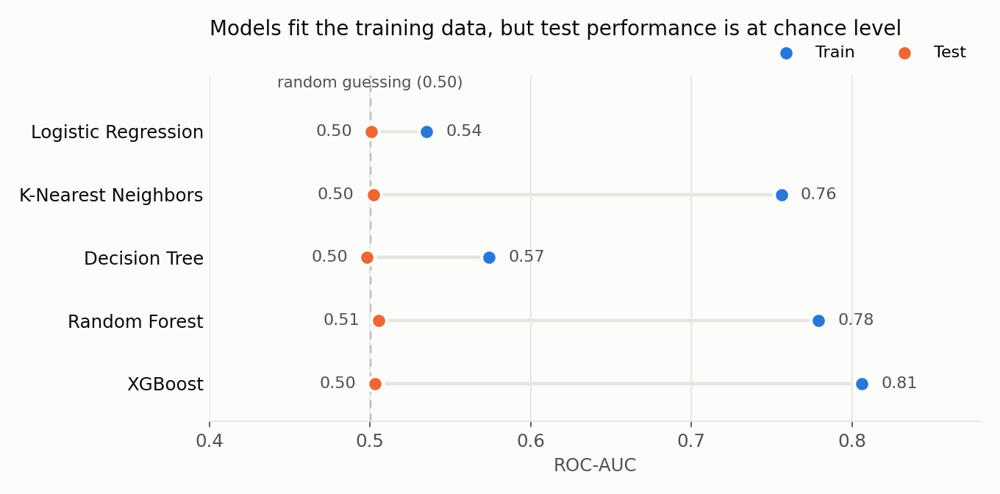
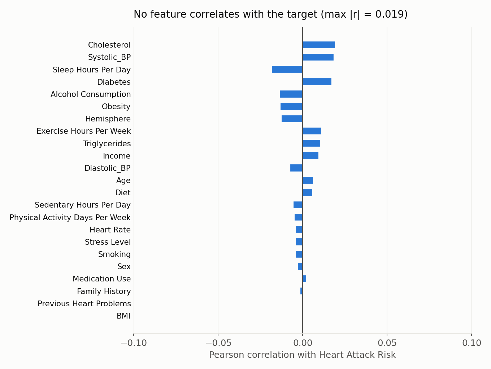

# Heart Attack Risk Prediction

An end-to-end machine learning pipeline in Python that cleans patient data, engineers medical risk features, trains five classifiers and serves predictions from the command line.

> Group project for the Subject Module Project in Computer Science at Roskilde University (December 2025).
> Original repository: [madsdegn/PredictionModel](https://github.com/madsdegn/PredictionModel)

**Tech:** Python · pandas · scikit-learn · XGBoost · matplotlib · joblib

---

## Key finding

None of the five models can predict heart attack risk on unseen data. Every model scores a **test ROC-AUC between 0.50 and 0.51**, which is the same as random guessing.



The tree-based models reach a training ROC-AUC of up to 0.81, but that does not carry over to the test set. They are memorising noise in the training data, not learning a pattern.

Looking at how each feature relates to the target explains why. No feature has a meaningful correlation with heart attack risk (the strongest is |r| = 0.019), and the dataset's author describes it as synthetic.



**Takeaway:** the pipeline works, but this dataset contains no learnable signal. Checking for signal in the data comes before tuning models.

### Results on the test set (20 % hold-out)

| Model | Accuracy | Precision | Recall | F1 | ROC-AUC | PR-AUC |
|---|---|---|---|---|---|---|
| Logistic Regression | 0.500 | 0.358 | 0.502 | 0.418 | 0.501 | 0.352 |
| K-Nearest Neighbors | 0.575 | 0.356 | 0.231 | 0.280 | 0.502 | 0.357 |
| Decision Tree | 0.552 | 0.350 | 0.295 | 0.320 | 0.498 | 0.354 |
| Random Forest | 0.533 | 0.356 | 0.376 | 0.366 | 0.506 | 0.365 |
| XGBoost | 0.517 | 0.357 | 0.435 | 0.392 | 0.503 | 0.367 |

35.8 % of patients are labelled "at risk", so always predicting "no risk" gives 64.2 % accuracy. The models use class weighting, which gives up some accuracy in exchange for finding more of the positive cases. A 5-fold cross-validation confirms the result (Random Forest: ROC-AUC 0.506 ± 0.015).

---

## How the pipeline works

1. **Data cleaning** (`src/data_cleaning.py`)
   - Encodes sex, hemisphere and diet as numbers.
   - Splits blood pressure (`"158/88"`) into systolic and diastolic values.
   - Drops identifiers and unused columns.
2. **Feature engineering** (`src/feature_engineering.py`)
   - A custom scikit-learn transformer adds pulse pressure, mean arterial pressure, a hypertension flag (≥ 130/80), a high-cholesterol flag (≥ 240) and a combined risk score.
3. **Models** (`src/models.py`)
   - Logistic Regression, KNN, Decision Tree, Random Forest and XGBoost.
   - Each model is wrapped in a scikit-learn `Pipeline` with its own preprocessing (scaling only where the model needs it).
   - Class imbalance is handled with `class_weight="balanced"`, or `scale_pos_weight` for XGBoost.
4. **Training and evaluation** (`src/train.py`, `src/evaluation.py`)
   - Stratified 60/20/20 train/validation/test split.
   - Reports accuracy, precision, recall, F1, ROC-AUC and PR-AUC.
   - Can optionally plot ROC curves, precision-recall curves and confusion matrices.
5. **Prediction** (`predict.py`)
   - Loads a saved model and scores new patients from a CSV file.

```
├── main.py               # CLI entry point: clean / train / predict
├── compare_models.py     # Trains and compares all five models
├── predict.py            # Predictions for new patient data
├── src/
│   ├── config.py         # Paths, feature lists, split sizes, seed
│   ├── data_cleaning.py
│   ├── feature_engineering.py
│   ├── models.py
│   ├── train.py
│   └── evaluation.py
├── data/
│   ├── HeartAttackData.csv          # Raw dataset
│   └── PredictHeartAttackData.csv   # Example input for predictions
└── docs/                 # Figures used in this README
```

---

## Getting started

Requires Python 3.9+.

```bash
git clone https://github.com/DanielHP7/heart-attack-risk-prediction.git
cd heart-attack-risk-prediction
python -m venv venv && source venv/bin/activate
pip install -r requirements.txt
```

Clean the raw data. This creates `data/CleanedHeartAttackData.csv`:

```bash
python main.py --step clean
```

Train one model (`log_reg`, `knn`, `dt`, `rf` or `xgb`):

```bash
python main.py --step train --model rf
```

Train and compare all models:

```bash
python compare_models.py
```

Predict risk for new patients:

```bash
python main.py --step predict --model rf --input data/PredictHeartAttackData.csv
```

To show evaluation plots after training, uncomment the `plot_evaluation(...)` line in `src/train.py`.

---

## Dataset

[Heart Attack Risk Prediction Dataset](https://www.kaggle.com/datasets/iamsouravbanerjee/heart-attack-prediction-dataset) by Sourav Banerjee on Kaggle. It has 8,763 patient records with 24 features, including age, cholesterol, blood pressure, lifestyle and country. The author describes it as a synthetic dataset.

## Team

Mads Degn, Julia Lundager, Daniel Holst Pedersen, Jonas Pheiffer and Magnus Stilling Østergaard.

**My contribution:** I was responsible for the logistic regression model.

## License

MIT. See [LICENSE](LICENSE).
